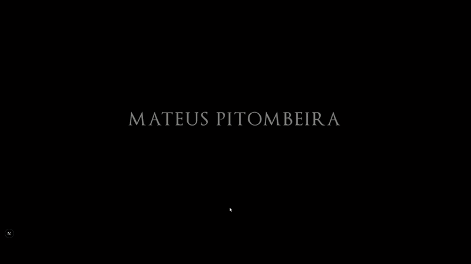

<h1 align="center">
  Soulslike Portfolio
</h1>

  Interactive developer portfolio inspired by atmospheric RPG interfaces.

Built as an immersive web experience using Next.js, React, TailwindCSS and Framer Motion.

## Features

- Bonfire-inspired navigation
- Interactive transitions
- Soulslike UI/UX
- Responsive design
- Bilingual support (EN/PT-BR)
- Dynamic About/Stats system
- Atmospheric sound effects
- Soapstone easter eggs

## Tech Stack

- Next.js
- React
- TypeScript
- TailwindCSS
- Framer Motion

## Preview

## Bonfire Interaction

---

[ screenshots ]
## Home

## Initial Screen

## Projects Screen

## About Screen

## Running locally

npm install

npm run dev

## Credits

Visual concepts and artwork assistance:
DE ALMEIDA